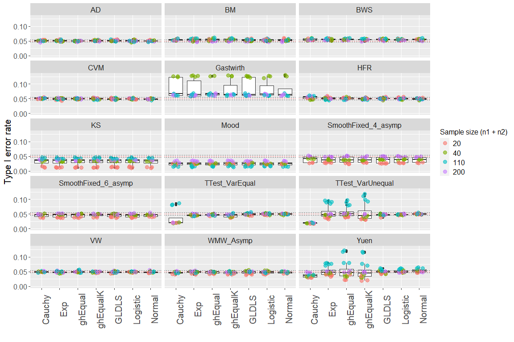
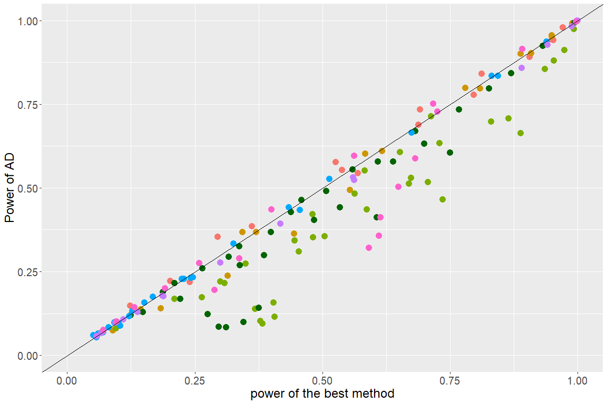
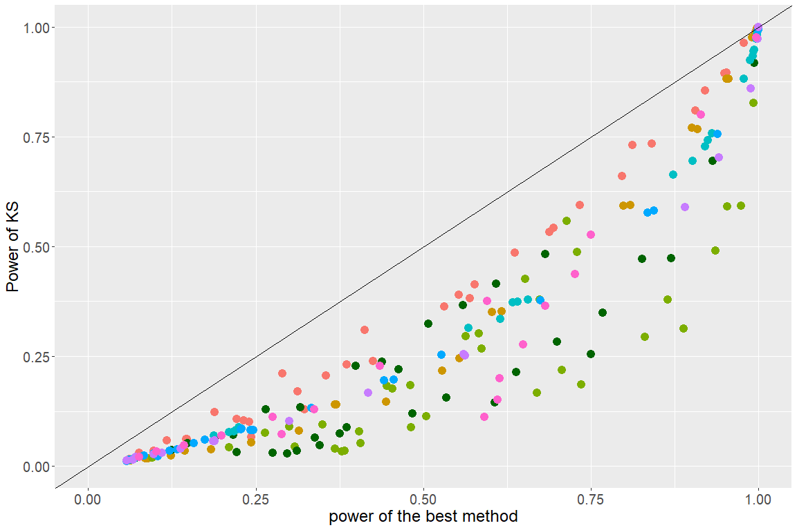
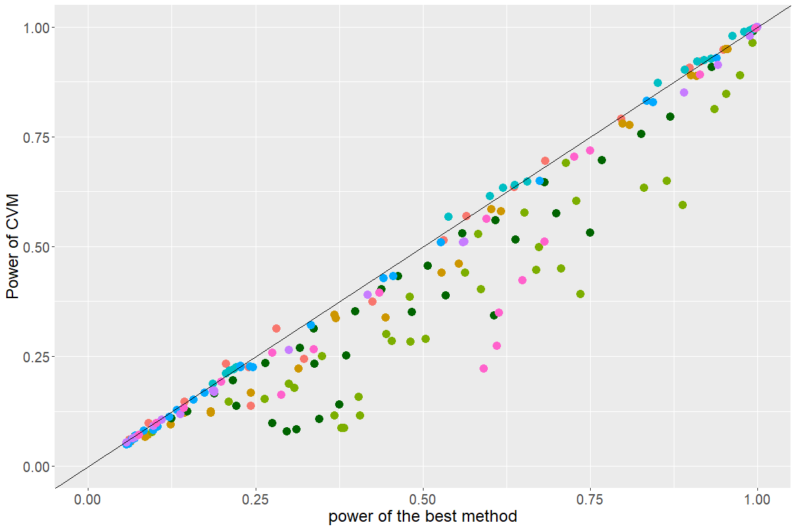
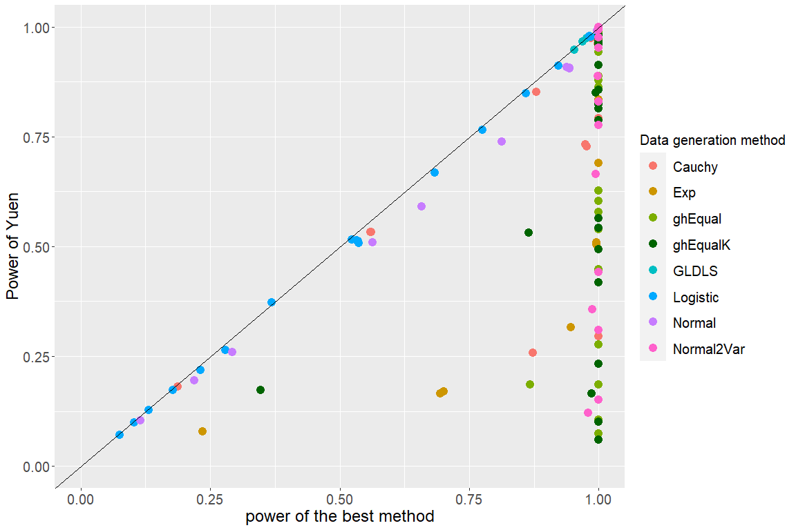
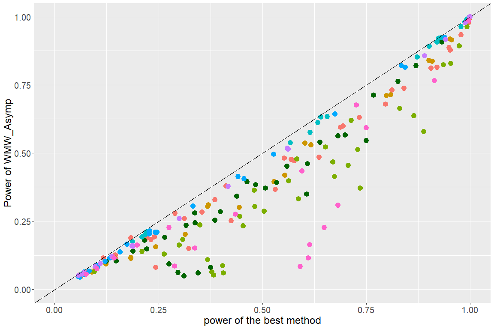
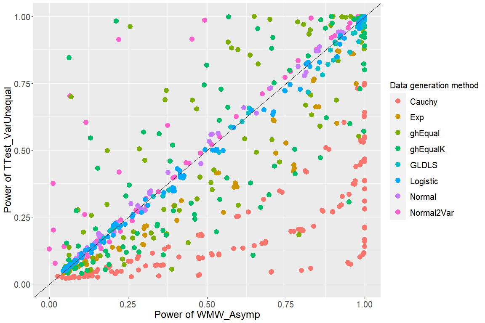

In this report, we will summarize the results of methods that have been neutralized and show the results that give more insights to the method and simulation scenarios. In section 1, the methods and data generation methods included in this framework will be summarized. In section 2, we will show the type I error rate control of all methods per data generation method. In section 3, the power-power plots of a few selected methods will be discussed, as well as the power-power plots that compare a method to the best results over the different scenario's. Every section, starting from section 2, will start with a brief summary of the results. More details can be found in the text below or for more numerical details the shiny app can be used (\<<https://dsi-uhasselt.shinyapps.io/Neutralise/>\<).

All the results shown in this report can be reproduced using the data in NeutraliseFiles or in the shiny app. This report is the results of choices made by the author, which can be viewed as not neutral. However, we believe that this report doesn't jeopardize the Neutralise initiative as all the results in this report can be reproduced. These results, as well as the results that are not included in this report, are publicly available and can be consulted. This report has been produced with Neutralise (v0.1.0) and NeutraliseFiles (v0.1.0).


## 1. Information

### 1.1 Methods

<div style="border: 1px solid #ddd; padding: 0px; overflow-y: scroll; height:500px; overflow-x: scroll; width:1000px; "><table style='width:100%; margin-left: auto; margin-right: auto; font-family: "Arial Narrow", arial, helvetica, sans-serif; margin-left: auto; margin-right: auto;' class="table table-striped lightable-paper">
<caption>Table 1: Summary of included methods</caption>
 <thead>
  <tr>
   <th style="text-align:left;position: sticky; top:0; background-color: #FFFFFF;"> Abbriviation </th>
   <th style="text-align:left;position: sticky; top:0; background-color: #FFFFFF;"> Name </th>
   <th style="text-align:left;position: sticky; top:0; background-color: #FFFFFF;"> Hypotheses </th>
   <th style="text-align:left;position: sticky; top:0; background-color: #FFFFFF;"> Description </th>
   <th style="text-align:left;position: sticky; top:0; background-color: #FFFFFF;"> References </th>
  </tr>
 </thead>
<tbody>
  <tr>
   <td style="text-align:left;"> AD </td>
   <td style="text-align:left;"> Asymptotic Anderson-Darling test </td>
   <td style="text-align:left;"> The null hypothesis states that two independent samples have the same underlying distribution. The alternative hypothesis states that two independent samples have different underlying distributions. </td>
   <td style="text-align:left;"> Two sample Anderson-Darling test. P-values based on asymptotic approximation. </td>
   <td style="text-align:left;"> Scholz, F. W., &amp; Stephens, M. A. (1987). K-Sample Anderson-Darling Tests. Journal of the American Statistical Association, 82(399), 918-924. https://doi.org/10.2307/2288805 (Rfunction: https://www.rdocumentation.org/packages/kSamples/versions/1.2-9/topics/ad.test) </td>
  </tr>
  <tr>
   <td style="text-align:left;"> BM </td>
   <td style="text-align:left;"> Brunner-Munzel test </td>
   <td style="text-align:left;"> The null hypothesis states stochastic equality P(X&gt;Y) = P(X&lt;Y), i.e. p = P(X&lt;Y)+ 0.5 P(X=Y) = 0.5. The alternative hypothesis states p is not equal to 0.5. </td>
   <td style="text-align:left;"> The Brunner--Munzel test for stochastic equality of two samples, which is also known as the Generalized Wilcoxon test. </td>
   <td style="text-align:left;"> Brunner, Edgar, and Ullrich Munzel. "The nonparametric Behrens-Fisher problem: asymptotic theory and a small-sample approximation." Biometrical Journal: Journal of Mathematical Methods in Biosciences 42.1 (2000): 17-25.(Rfunction: https://www.rdocumentation.org/packages/lawstat/versions/3.4/topics/brunner.munzel.test) </td>
  </tr>
  <tr>
   <td style="text-align:left;"> BWS </td>
   <td style="text-align:left;"> Asymptotic Baumgartner-Weiss-Schindler test test </td>
   <td style="text-align:left;"> The null hypothesis states that two independent samples have the same underlying distribution. The alternative hypothesis states that two independent samples have different underlying distributions. </td>
   <td style="text-align:left;"> Two sample Baumgartner-Weiss-Schindler test test. P-values based on asymptotic approximation. </td>
   <td style="text-align:left;"> W. Baumgartner, P. Weiss, H. Schindler, ’A nonparametric test for the general two-sample problem’, Biometrics 54, no. 3 (Sep., 1998): pp. 1129-1135. </td>
  </tr>
  <tr>
   <td style="text-align:left;"> CVM </td>
   <td style="text-align:left;"> Cramer-Von Mises test </td>
   <td style="text-align:left;"> The null hypothesis is defined as two samples that come from the same distribution, against the alternative the samples differ in location. </td>
   <td style="text-align:left;"> A two-sample permutation based test on the Cramer-Von Mises test statistic. With default bootstraps: 2000 </td>
   <td style="text-align:left;"> Brown, B. M. (1982). Cramer-von Mises Distributions and Permutation Tests.  Biometrika, 69(3), 619-624. https://doi.org/10.2307/2335997 (Rfunction: https://search.r-project.org/CRAN/refmans/twosamples/html/cvm_test.html) </td>
  </tr>
  <tr>
   <td style="text-align:left;"> Gastwirth </td>
   <td style="text-align:left;"> Percentile Modified Wilcoxon-Mann-Whitney test </td>
   <td style="text-align:left;"> The null hypothesis is defined as P(X&lt;=Y)= 0.5, which coincides with the equality of distributions under the assumption of symmetry and equal shape. The alternative hypothesis is that P(X&lt;=Y) is not equal to 0.5, which can be interpreted as a location shift. </td>
   <td style="text-align:left;"> The Percentile Modified Asymptotic Wilcoxon-Mann-Whitney test of Gastwirth (1965) with P = R = (15% * total sample size)+ 1. P-values are calculated from the normal approximation. </td>
   <td style="text-align:left;"> Gastwirth, J. L. (1965). Percentile modifications of two sample rank tests. Journal of the American Statistical Association, 60(312), 1127-1141. </td>
  </tr>
  <tr>
   <td style="text-align:left;"> H </td>
   <td style="text-align:left;"> Asymptotic Hogg-Fisher-Randles adaptive test </td>
   <td style="text-align:left;"> The null hypothesis is defined as P(X&lt;=Y)= 0.5, which coincides with the equality of distributions under the assumption of symmetry and equal shape. The alternative hypothesis is that P(X&lt;=Y) is not equal to 0.5. </td>
   <td style="text-align:left;"> Two sample Hogg-Fisher-Randles adaptive test. P-values based on asymptotic approximation. </td>
   <td style="text-align:left;"> Hogg, R. V., Fisher, D. M., &amp; Randles, R. H. (1975). A two-sample adaptive distribution-free test. Journal of the American Statistical Association, 70(351a), 656-661. </td>
  </tr>
  <tr>
   <td style="text-align:left;"> KS </td>
   <td style="text-align:left;"> Asymptotic Kolmogorov-Smirnov test </td>
   <td style="text-align:left;"> The null hypothesis states that two independent samples have the same underlying distribution. The alternative hypothesis states that two independent samples have different underlying distributions. </td>
   <td style="text-align:left;"> Two sample Kolmogorov-Smirnov test . P-values based on asymptotic approximation </td>
   <td style="text-align:left;"> Kolmogorov, A. N., Sulla Determinazione Empirica di Una Legge di Distribuzione, Giornale dell'Istituto Italiano degli Attuari, 4. 83-91. 1933. Smirnoff, N. "Sur les ?carts de la courbe de distribution empirique." Matematicheskii Sbornik 48.1 (1939): 3-26. </td>
  </tr>
  <tr>
   <td style="text-align:left;"> Mood </td>
   <td style="text-align:left;"> Mood's median test </td>
   <td style="text-align:left;"> The null hypothesis is defined for testings equality of medians, while assuming that the distributions are otherwise the same. The alternative states that the medians are different in both groups. </td>
   <td style="text-align:left;"> Performs a Mood's median test to compare medians of independent samples. A Fisher's exact test is used if the number of data values is &lt; 200; otherwise a chi-square test is used, with Yates continuity correction if necessary </td>
   <td style="text-align:left;"> MOOD, A. M. (1954). On the asymptotic efficiency of certain non-parametric two-sample tests. Ann. Math.Statist. 25, 514 22. (Rfunction: https://www.rdocumentation.org/packages/RVAideMemoire/versions/0.9-81-2/topics/mood.medtest) </td>
  </tr>
  <tr>
   <td style="text-align:left;"> SmoothFixed_4_asymp </td>
   <td style="text-align:left;"> Asymptotic smooth test of order 4 with Legendre polynomials </td>
   <td style="text-align:left;"> The null hypothesis states that two independent samples have the same underlying distribution. The alternative hypothesis states that two independent samples have different underlying distributions based on the first 4 (or 6) moments. </td>
   <td style="text-align:left;"> Two sample smooth test with fixed order 4 and Legendre polynomials. P-values based on asymptotic approximation. The implementation is adapted from the R code from Thas (2010). </td>
   <td style="text-align:left;"> Janic‐Wróblewska A., &amp; Ledwina, T. (2000). Data driven rank test for two‐sample problem. Scandinavian Journal of Statistics, 27(2), 281-297. Thas, O. (2010). Comparing distributions (Vol. 233). New York: Springer. </td>
  </tr>
  <tr>
   <td style="text-align:left;"> SmoothFixed_6_asymp </td>
   <td style="text-align:left;"> Asymptotic smooth test of order 6 with Legendre polynomials </td>
   <td style="text-align:left;"> The null hypothesis states that two independent samples have the same underlying distribution. The alternative hypothesis states that two independent samples have different underlying distributions based on the first 4 (or 6) moments. </td>
   <td style="text-align:left;"> Two sample smooth test with fixed order 6 and Legendre polynomials. P-values based on asymptotic approximation.The implementation is adapted from the R code from Thas (2010). </td>
   <td style="text-align:left;"> Janic‐Wróblewska A., &amp; Ledwina, T. (2000). Data driven rank test for two‐sample problem. Scandinavian Journal of Statistics, 27(2), 281-297.Thas, O. (2010). Comparing distributions (Vol. 233). New York: Springer. </td>
  </tr>
  <tr>
   <td style="text-align:left;"> TTest_VarEqual </td>
   <td style="text-align:left;"> Two-sample Student's t-Test </td>
   <td style="text-align:left;"> The null hypothesis states that both samples come from same underlying distribution, under the assumption of normality and equal variances. The alternative hypothesis is defined as a location shift (means differ between the groups). </td>
   <td style="text-align:left;"> Two sample t-test under equal variance assumption. </td>
   <td style="text-align:left;"> None </td>
  </tr>
  <tr>
   <td style="text-align:left;"> TTest_VarUnequal </td>
   <td style="text-align:left;"> Welch two-sample t-test </td>
   <td style="text-align:left;"> The null hypothesis states that both samples come from the same underlying distribution, restricted under the assumption of normality.  The alternative hypothesis is defined as a location shift (means differ between the groups). </td>
   <td style="text-align:left;"> Two sample t-test without equal variance assumption. </td>
   <td style="text-align:left;"> Welch, Bernard L. "The significance of the difference between two means when the population variances are unequal." Biometrika 29.3/4 (1938): 350-362. </td>
  </tr>
  <tr>
   <td style="text-align:left;"> VW </td>
   <td style="text-align:left;"> van der Waerden normal scores test </td>
   <td style="text-align:left;"> The null hypothesis is defined as P(X&lt;=Y)= 0.5, which coincides with the equality of distributions under the assumption of symmetry and equal shape. The alternative hypothesis is that P(X&lt;=Y) is not equal to 0.5, which can be interpreted as a location shift. </td>
   <td style="text-align:left;"> Performs a van der Waerden test of the null hypothesis that the location parameters of the distribution of x are the same in each group (sample). The alternative is that they differ in at least one. </td>
   <td style="text-align:left;"> van der Waerden, B.L. (1953). "Order tests for the two-sample problem. II, III", Proceedings of the Koninklijke Nederlandse Akademie van Wetenschappen, Serie A, 564, 303-310, 311-316. (Rfunction: https://search.r-project.org/CRAN/refmans/DescTools/html/VanWaerdenTest.html) </td>
  </tr>
  <tr>
   <td style="text-align:left;"> WMW_Asymp </td>
   <td style="text-align:left;"> Asymptotic Wilcoxon-Mann-Whitney test </td>
   <td style="text-align:left;"> The null hypothesis is defined as P(X&lt;=Y)= 0.5, which coincides to equality of distributions under the assumption of symmetry and equal shape. The alternative hypothesis that P(X&lt;=Y) is not equal to 0.5. </td>
   <td style="text-align:left;"> Two sample Wilcoxon-Mann-Whitney test. P-values based on asymptotic approximation </td>
   <td style="text-align:left;"> Wilcoxon, F. (1945). Individual comparisons by ranking methods. Biom. Bull., 1, 80-83. </td>
  </tr>
  <tr>
   <td style="text-align:left;"> Yuen </td>
   <td style="text-align:left;"> Yuen's test </td>
   <td style="text-align:left;"> The null hypothesis states that both samples come from the same underlying distribution.  The alternative hypothesis is defined as a location shift (trimmed means differ between the groups). </td>
   <td style="text-align:left;"> Yuen's test for trimmed means </td>
   <td style="text-align:left;"> Yuen, K. K. (1974). The two sample trimmed t for unequal population variances. Biometrika, 61, 165-170 (https://cran.r-project.org/web/packages/WRS2/vignettes/WRS2.pdf) </td>
  </tr>
</tbody>
</table></div>

### 1.2 Simulation scenarios

<table style="width:100%; margin-left: auto; margin-right: auto;" class="table table-striped">
<caption>Table 2: Summary of included data generation methods per sample size setting. There are 3 balanced sample size settings included of which the total sample size (n1+n2) is equal to 20,40 and 200. One unbalanced sample size setting was included, n1=10 and n2=100. Specific parameter values for all scenarios are included in the supplementary of the report. </caption>
 <thead>
  <tr>
   <th style="text-align:left;"> Data Generation method </th>
   <th style="text-align:left;"> Description </th>
   <th style="text-align:left;"> Parameters </th>
   <th style="text-align:left;"> Scenarios per sample size setting </th>
  </tr>
 </thead>
<tbody>
  <tr>
   <td style="text-align:left;"> Normal </td>
   <td style="text-align:left;"> simulation of two normal distributions with equal variance </td>
   <td style="text-align:left;"> delta = locationshift, sd = standard deviaton </td>
   <td style="text-align:left;"> 18 </td>
  </tr>
  <tr>
   <td style="text-align:left;"> Normal2Var </td>
   <td style="text-align:left;"> simulation of two normal distributions with unequal variance </td>
   <td style="text-align:left;"> delta = locationshift, sd1 = standard deviaton group 1, sd2 = standard deviaton group 2 </td>
   <td style="text-align:left;"> 18 </td>
  </tr>
  <tr>
   <td style="text-align:left;"> Cauchy </td>
   <td style="text-align:left;"> Simulation of the Cauchy distribution </td>
   <td style="text-align:left;"> delta = locationshift, scale1 = scale parameter group 1 (spread of distribution), scale2 = scale parameter group 2 (spread of distribution) </td>
   <td style="text-align:left;"> 36 </td>
  </tr>
  <tr>
   <td style="text-align:left;"> Exp </td>
   <td style="text-align:left;"> Simulation of the exponential distribution </td>
   <td style="text-align:left;"> delta = locationshift, rate1 = rate parameter for the exponential distribution of both groups (mean = 1/rate, var=1/rate² </td>
   <td style="text-align:left;"> 30 </td>
  </tr>
  <tr>
   <td style="text-align:left;"> ghEqual </td>
   <td style="text-align:left;"> Simulation of the g-and-h distribution, with an equal scale parameter in both groups and a kurtosis parameter = 0 in both groups. </td>
   <td style="text-align:left;"> delta = locationshift, sd = scale parameter (spread of distribution) for both groups, g1 = skewness parameter for group 1, g2 = skewness parameter for group 2, h = kurtosis parameters for both groups </td>
   <td style="text-align:left;"> 35 </td>
  </tr>
  <tr>
   <td style="text-align:left;"> ghEqualK </td>
   <td style="text-align:left;"> Simulation of the g-and-h distribution, with an equal scale parameter in both groups and a kurtosis parameter = 0.20 in both groups. </td>
   <td style="text-align:left;"> delta = locationshift, sd = scale parameter (spread of distribution) for both groups, g1 = skewness parameter for group 1, g2 = skewness parameter for group 2, h = kurtosis parameters for both groups </td>
   <td style="text-align:left;"> 35 </td>
  </tr>
  <tr>
   <td style="text-align:left;"> GLDLS </td>
   <td style="text-align:left;"> The Generalized Tukey Lambda distribution -&gt; generates skew distributions, consider only locationshift </td>
   <td style="text-align:left;"> delta = locationshift, scale = scale parameter (spread of distribution) for both groups, lambda3 = first shape parameter for both groups, lambda4 = second shape parameter for both groups </td>
   <td style="text-align:left;"> 25 </td>
  </tr>
  <tr>
   <td style="text-align:left;"> Logistic </td>
   <td style="text-align:left;"> Simulation of two logistic distributions with equal variance </td>
   <td style="text-align:left;"> delta = locationshift, sd = scale parameter (spread of distribution)  of both groups </td>
   <td style="text-align:left;"> 28 </td>
  </tr>
</tbody>
</table>

### 1.3 Session information


```
## R version 4.3.1 (2023-06-16 ucrt)
## Platform: x86_64-w64-mingw32/x64 (64-bit)
## Running under: Windows 10 x64 (build 19044)
## 
## Matrix products: default
## 
## 
## locale:
## [1] LC_COLLATE=Dutch_Belgium.utf8  LC_CTYPE=Dutch_Belgium.utf8   
## [3] LC_MONETARY=Dutch_Belgium.utf8 LC_NUMERIC=C                  
## [5] LC_TIME=Dutch_Belgium.utf8    
## 
## time zone: Europe/Brussels
## tzcode source: internal
## 
## attached base packages:
## [1] stats     graphics  grDevices utils     datasets  methods   base     
## 
## other attached packages:
## [1] kableExtra_1.3.4 dplyr_1.1.3      knitr_1.45       ggplot2_3.4.4   
## [5] Neutralise_0.1.0
## 
## loaded via a namespace (and not attached):
##  [1] gtable_0.3.4      jsonlite_1.8.7    highr_0.10        compiler_4.3.1   
##  [5] webshot_0.5.5     tidyselect_1.2.0  xml2_1.3.5        stringr_1.5.0    
##  [9] jquerylib_0.1.4   systemfonts_1.0.5 scales_1.2.1      yaml_2.3.7       
## [13] fastmap_1.1.1     R6_2.5.1          generics_0.1.3    tibble_3.2.1     
## [17] munsell_0.5.0     svglite_2.1.2     bslib_0.5.1       pillar_1.9.0     
## [21] rlang_1.1.1       utf8_1.2.3        cachem_1.0.8      stringi_1.7.12   
## [25] xfun_0.41         sass_0.4.7        viridisLite_0.4.2 cli_3.6.1        
## [29] withr_2.5.2       magrittr_2.0.3    digest_0.6.33     rvest_1.0.3      
## [33] grid_4.3.1        rstudioapi_0.15.0 lifecycle_1.0.4   vctrs_0.6.3      
## [37] evaluate_0.23     glue_1.6.2        fansi_1.0.4       colorspace_2.1-0 
## [41] rmarkdown_2.25    httr_1.4.7        tools_4.3.1       pkgconfig_2.0.3  
## [45] htmltools_0.5.7
```

## 2. Type I error rate control

[**Summary:**]{.underline}

1.  [Aim:]{.underline}

    Screen methods under H~0~ scenarios and explore Type I error rate control at the nominal level of 5%.

2.  [Procedure:]{.underline}

    Methods with a Type I error rate that is above the largest acceptable estimated Type I error rate are filtered out for this specific scenario (i.e. liberal methods). This is based on 10000 simulation runs.

3.  [Results:]{.underline}

    -   **The percentile modified asymptotic Wilcoxon-Mann-Whitney test (Gastwirth)** can be considered as a method that is too liberal for all included scenarios, especially for small sample sizes.

    -   **The Welch test** behaves too liberal for scenarios with unequal sample sizes (n1=10, n2=100) in skewed distributions such as the exponential distribution and the g-and-h distribution.

    -   **The Yuen** test behaves in general too too liberal for scenarios with unequal sample sizes (n1=10, n2=100), except in scenarios of the Cauchy distribution.

    -   **The two sample student t-test** behaves too liberal in scenarios with unequal sample sizes in long-tailed distributions, such as the Cauchy distribution.

    -   **The Brunner-Munzel test** is too liberal in the type I error rate control for scenarios with small and unbalanced sample sizes.

    -   **The asymptotic Kolmogorov-Smirnov test and Mood's median test** have a Type I error rate control that is conservative in most scenarios.

    -   The following methods give the most stable results over all methods: **Anderson-Darling test**, **Van der Waerden normal scores test and the Cramer-Von Mises test**.

Figure 1 shows the empirical Type I error rates of all included methods per data generation method. All tests were performed at the 5% level of significance (red dotted line), and the error rates were computed based on 10000 simulation runs. Points above (below) the upper (lower) horizontal reference line (black dotted line) correspond to liberal (conservative) tests. These liberal tests will be filtered out of for those specific scenarios, as comparing these methods to methods that control the type I error would not be fair or sensible.

The percentile modified asymptotic Wilcoxon-Mann-Whitney test (Gastwirth), has a Type I error rate that is too liberal in all included scenarios, these scenarios will be filtered out in the following sections. This inflation of the Type I error rate, especially in small sample sizes, is caused by using the normal approximation which is not valid for small sample sizes. The choice of the parameters P and R (percentile of the extremes of the rank order used) can also affect the behavior if this is not appropriate. However more scenarios with different values are needed to know what is appropriate.

The Brunner-Munzel test is too liberal in scenarios with small and unbalanced sample sizes, this shows that the small sample approximation with the t-distribution does not behave well in terms of type I error rate control.

For the Welch and Yuen test, you can see a clear inflation of the Type I error rate for the scenarios with unbalanced sample sizes, and with skewed distributions (Exponential, g-and-h distribution). These skewed distributions are violations to the distributional assumption of the Welch test. The Yuen test is an adaptation of the Welch test and uses a trimmed two sample t statistic, which makes the test more robust in case of symmetric heavy-tailed distributions, such as the Cauchy distribution. However, for all other data generation methods, the simulation results show that trimming in the scenarios with unbalanced sample sizes causes an inflation of the Type I error, as trimming strongly unbalanced groups can affect the shape and symmetry of the resulting distributions such that the trimmed mean does not represent the true mean.

The two-sample student's t-test has a conservative Type I error rate control for the balanced scenarios from the Cauchy distribution, and in contrast a too liberal Type I error rate control for the unbalanced scenarios. This contrast can be explained by the impact of the extreme values of the Cauchy distribution in the unbalanced setting being stronger than in the balanced scenarios.

The asymptotic Kolmogorov-Smirnov test and Mood's median test have a Type I error rate control that is conservative in most scenarios, this result reflects that the sample sizes used are too small for the approximations to control the Type I error rate at the nominal significance level.

<!-- -->

## 3. Power-power curve: Best method

[**Summary:**]{.underline}

1.  [Aim:]{.underline}

    Selecting a few methods with overall a high power in different scenarios.

2.  [Procedure:]{.underline}

    The methods are compared with the 'best method' in each scenario of sample size 10 and 100 (per group). When points (scenarios) are situated above the diagonal of the plot, the specified method is performing better than the 'best method(s)' of all other included methods. When points (scenarios) are situated below the diagonal of the plot, the 'best method(s)' of all other included methods performs better that the specified method. Scenarios in which the method is too liberal in the Type I error rate control were filtered out (see section 2).

3.  [Results:]{.underline}

    -   **KS and Mood** show plots that reflect a low power in comparison to the best performing methods (results mainly under the diagonal). This is also a reflection of the conservative Type I error rate (section 2).

    -   **The Welch Test and the two-sample student's t-test** noticeably lack power for scenarios from skewed and heavy-tailed distributions.

    -   **The two sample smooth test with fixed order 4 and Legendre polynomials** outperforms the Welch test in scenarios of the normal distribution with unequal variances.

    -   For small sample sizes in the logistic distribution scenarios, slightly better tests exist than the **Asymptotic** **WMW test**.

    -   The **AD test** behaves the most stable across all scenarios for both sample sizes.(points close to the diagonal)

    -   The worst performing test is **the two sample smooth test with fixed order 6 and Legendre Polynomials**.

In the figures below (Figure:2-14), the power-power curves are shown between the specified method versus the 'best' performing method in that specific scenario (distribution). These plots are given for sample size 20 (left column) and sample size 200 (right column). Thirteen methods are included, Gastwirth was exluded as this method had a Type I error rate that was far too liberal for all included scenarios.

In general, the results of the scenarios with a total sample size of 20 are more scattered around the diagonal of the plot, while the results of the scenarios with a total sample size of 200 are more centered around the top right part of the diagonal and/or the vertical line of x=1. This shows that in the scenarios with a total sample size of 200, the best method(s) often has a maximum power of 100% in these scenarios (vertical line of x=1). This reflects that for these scenarios on the line x=1, a better method exists than the specified method. In contrast, for the scenarios with a total sample size of 20, there is more variability in the results of the 'best method' which results in a more scattered pattern around the diagonal. This also in part reflects that when the sample size increases the power increases.

The tests that had a very conservative type I error rate control (KS, Mood), also show power-power curves that reflect the lack of power in comparison to the best performing methods (points mainly below the diagonal). This lack in power is also noticeable for the results for the Cauchy, exponential and g-h distributions of the two-sample Student's t-test and the Welch t-test. Remarkably, for some scenarios of the normal distributions with unequal variances, the Welch t-test has much lower power than the best competitor, the best competitor is the two-sample smooth test with fixed order 4 and Legendre polynomials.

For the WMW test, the power-power plot shows that the test has at least similar results in comparison to the best method for the logistic distribution with sample size 200 (as expected), but for the small sample sizes slightly better tests exist. The plots of Anderson-Darling(AD) have more of the observations around the diagonal for both sample sizes in comparison to all other methods. Hence, the AD test has often the largest power, and when it does not, its power is not much smaller than the power of the best competitor (i.e. the points are close to the diagonal). The worst performing test is the two sample smooth test with fixed order 6 and Legendre Polynomials.

**Based on these results we selected AD, CVM, the Welch test, Student's t-test, WMW test and two-sample smooth test with fixed order 4 and Legendre polynomials**. Hence, the plots are better evaluated in some more detail in the next section.


<div class="figure">

<p class="caption">Figure 2. Left:(n=20)  AD has the largest power in 61 of the  176 scenarios, which is  34.66 % of the scenarios.   The median of the power differences for scenarios where  AD  has smaller power than the best test is  0.032 --- Right: (n=200)  AD has the largest power in 150 of the  225 scenarios, which is  66.67 % of the scenarios.   The median of the power differences for scenarios where  AD  has smaller power than the best test is  0.0082</p>
</div>


<div class="figure">

<p class="caption">Figure 3. Left:(n=20)  KS has the largest power in 5 of the  225 scenarios, which is  2.22 % of the scenarios.   The median of the power differences for scenarios where  KS  has smaller power than the best test is  0.1641 --- Right: (n=200)  KS has the largest power in 135 of the  225 scenarios, which is  60 % of the scenarios.   The median of the power differences for scenarios where  KS  has smaller power than the best test is  0.0357</p>
</div>


<div class="figure">

<p class="caption">Figure 4. Left:(n=20)  CVM has the largest power in 38 of the  207 scenarios, which is  18.36 % of the scenarios.   The median of the power differences for scenarios where  CVM  has smaller power than the best test is  0.0291 --- Right: (n=200)  CVM has the largest power in 144 of the  225 scenarios, which is  64 % of the scenarios.   The median of the power differences for scenarios where  CVM  has smaller power than the best test is  0.0083</p>
</div>


<div class="figure">

<p class="caption">Figure 5. Left:(n=20)  TTest_VarEqual has the largest power in 38 of the  225 scenarios, which is  16.89 % of the scenarios.   The median of the power differences for scenarios where  TTest_VarEqual  has smaller power than the best test is  0.0879 --- Right: (n=200)  TTest_VarEqual has the largest power in 86 of the  225 scenarios, which is  38.22 % of the scenarios.   The median of the power differences for scenarios where  TTest_VarEqual  has smaller power than the best test is  0.162</p>
</div>


<div class="figure">

<p class="caption">Figure 6. Left:(n=20)  TTest_VarUnequal has the largest power in 11 of the  225 scenarios, which is  4.89 % of the scenarios.   The median of the power differences for scenarios where  TTest_VarUnequal  has smaller power than the best test is  0.0455 --- Right: (n=200)  TTest_VarUnequal has the largest power in 83 of the  225 scenarios, which is  36.89 % of the scenarios.   The median of the power differences for scenarios where  TTest_VarUnequal  has smaller power than the best test is  0.1622</p>
</div>


<div class="figure">

<p class="caption">Figure 7. Left:(n=20)  Yuen has the largest power in 11 of the  225 scenarios, which is  4.89 % of the scenarios.   The median of the power differences for scenarios where  Yuen  has smaller power than the best test is  0.0758 --- Right: (n=200)  Yuen has the largest power in 89 of the  225 scenarios, which is  39.56 % of the scenarios.   The median of the power differences for scenarios where  Yuen  has smaller power than the best test is  0.0297</p>
</div>


<div class="figure">

<p class="caption">Figure 8. Left:(n=20)  BM has the largest power in 6 of the  32 scenarios, which is  18.75 % of the scenarios.   The median of the power differences for scenarios where  BM  has smaller power than the best test is  0.0304 --- Right: (n=200)  BM has the largest power in 103 of the  212 scenarios, which is  48.58 % of the scenarios.   The median of the power differences for scenarios where  BM  has smaller power than the best test is  0.0196</p>
</div>


<div class="figure">

<p class="caption">Figure 9. Left:(n=20)  VW has the largest power in 6 of the  225 scenarios, which is  2.67 % of the scenarios.   The median of the power differences for scenarios where  VW  has smaller power than the best test is  0.0377 --- Right: (n=200)  VW has the largest power in 98 of the  207 scenarios, which is  47.34 % of the scenarios.   The median of the power differences for scenarios where  VW  has smaller power than the best test is  0.0208</p>
</div>


<div class="figure">

<p class="caption">Figure 10. Left:(n=20)  Mood has the largest power in 4 of the  225 scenarios, which is  1.78 % of the scenarios.   The median of the power differences for scenarios where  Mood  has smaller power than the best test is  0.1575 --- Right: (n=200)  Mood has the largest power in 71 of the  225 scenarios, which is  31.56 % of the scenarios.   The median of the power differences for scenarios where  Mood  has smaller power than the best test is  0.1337</p>
</div>


<div class="figure">

<p class="caption">Figure 11. Left:(n=20)  HFR has the largest power in 29 of the  115 scenarios, which is  25.22 % of the scenarios.   The median of the power differences for scenarios where  HFR  has smaller power than the best test is  0.0485 --- Right: (n=200)  HFR has the largest power in 101 of the  183 scenarios, which is  55.19 % of the scenarios.   The median of the power differences for scenarios where  HFR  has smaller power than the best test is  0.013</p>
</div>


<div class="figure">

<p class="caption">Figure 12. Left:(n=20)  WMW_Asymp has the largest power in 5 of the  225 scenarios, which is  2.22 % of the scenarios.   The median of the power differences for scenarios where  WMW_Asymp  has smaller power than the best test is  0.0484 --- Right: (n=200)  WMW_Asymp has the largest power in 107 of the  225 scenarios, which is  47.56 % of the scenarios.   The median of the power differences for scenarios where  WMW_Asymp  has smaller power than the best test is  0.0171</p>
</div>


<div class="figure">

<p class="caption">Figure 13. Left:(n=20)  SmoothFixed_4_asymp has the largest power in 28 of the  225 scenarios, which is  12.44 % of the scenarios.   The median of the power differences for scenarios where  SmoothFixed_4_asymp  has smaller power than the best test is  0.132 --- Right: (n=200)  SmoothFixed_4_asymp has the largest power in 170 of the  225 scenarios, which is  75.56 % of the scenarios.   The median of the power differences for scenarios where  SmoothFixed_4_asymp  has smaller power than the best test is  0.0721</p>
</div>


<div class="figure">

<p class="caption">Figure 14. Left:(n=20)  SmoothFixed_6_asymp has the largest power in 0 of the  225 scenarios, which is  0 % of the scenarios.   The median of the power differences for scenarios where  SmoothFixed_6_asymp  has smaller power than the best test is  0.4511 --- Right: (n=200)  SmoothFixed_6_asymp has the largest power in 5 of the  225 scenarios, which is  2.22 % of the scenarios.   The median of the power differences for scenarios where  SmoothFixed_6_asymp  has smaller power than the best test is  0.8241</p>
</div>

## 4. Power-Power curve

[**Summary:**]{.underline}

1.  [Aim:]{.underline}

    Comparing the selected methods in section 3, and use the empirically computed moments of the scenarios to understand the differences.

2.  [Procedure:]{.underline}

    The methods are compared with each other in all scenarios where they both control the Type I error rate. When points (scenarios) are situated close to the diagonal, the methods behave similar in power. When the points are further away from the diagonal, one methods outperforms the other method. The Shiny app of Neutralise is used to get more information about the empirically computed moments.

3.  [Results:]{.underline}

    -   **AD vs CVM:**

        -   AD outperforms CVM in most scenarios

        -   CVM behaves better in some scenarios of the Cauchy distribution and Normal distribution with unequal variances.

            -   Cauchy distribution: in scenarios with larger sample sizes CVM performs better

            -   Normal distribution with unequal variances: CVM performs better in scenarios where the moments of the Normal distribution of each group reflect large differences of variances and there is an unbalanced setting (n=110).

    -   **Two Sample Student-t-test vs Welch test:**

        -   The results of both tests are similar in most scenarios.

        -   The Welch test outperforms the two sample student's t-test in scenarios of the normal distribution with unequal variances and sample sizes. This is also reflected in the estimated moments of those scenarios.

    -   **Welch test vs asymptotic WMW test:**

        -   WMW outperforms the Welch test for scenarios from the Cauchy and Exponential distribution (long tailed and asymmetric distributions).

        -   For the more symmetric distributions the methods have similar power (close to the diagonal)

        -   The Welch performs better when the estimated skeweness of both groups is of opposite sign for scenarios of the g-and-h distribution.

    -   **Asymptotic WMW test vs Two sample smooth test with fixed order 4 and Legendre polynomials:**

        -   WMW outperforms the smooth test in the logistic and other symmetric distributions.

        -   Smooth test outperforms the more skewed and heavy tailed distributions.

The power-power plots are based on 10000 simulation runs and 5% significance level. The scenarios where the type I error was too liberal are filtered out.

The first comparison (Figure 15, top left), the Anderson-Darling test (AD) versus the Cramer-Von Mises test (CVM), shows that AD has a higher power in most scenarios. For some scenario's in the Cauchy distribution and Normal distribution with unequal variances, CVM has a higher power. More specific, in Cauchy scenarios with a high sample size and in Normal scenarios with unequal variances with unequal sample sizes.

The power-power plot of the two sample student t-test and the Welch test (Figure 15, top right), show the results of most scenarios are close to the diagonal which means that they have similar results in those scenarios. However for the scenarios from the Normal distribution with unequal variances and unequal sample sizes, the Welch test outperforms the two sample student-t test.

The third comparison (Figure 15, down left), compares the Welch t-test to the Wilcoxon-Mann-Whitney test (WMW). In this comparison it's clear that WMW outperforms the Welch t-test for scenarios from the Cauchy and Exponential distribution. The plot also shows that many points are close to the diagonal (particularly for the symmetric distributions), indicating that for these distributions the powers of the two tests are close to one another. However, there are still many other points far off the diagonal, towards both sides. This shows that for some scenarios (skew and/or heavy tailed distributions) the powers of the WMW test and the Welch t-test may be very different. Sometimes the WMW wins, other times the Welch t-test wins.

The last plot (Figure 15, down right) compares WMW with Two sample smooth test with fixed order 4 and Legendre polynomials. WMW outperforms the smooth test in the logistic distribution, and has a higher power in the scenarios that come from the more symmetric distributions. In contrast, the smooth test has a higher power in the more skewed and/or heavy tailed distributions, which is what we would expect from the smooth test.

<div class="figure">

<p class="caption">Figure 15. Power-Power plots for comparing two methods. Top left: Anderson-Darling versus Kolmogrov Smirnov test. Top right: Welch versus the two sample student-t test. Down left: Welch two sample test versus the Wilcoxon-Mann-Whitney test. Down Right: Two sample smooth test with fixed order 4 and Legendre polynomials versus the Wilcoxon-Mann-Whitney test.</p>
</div>

## 5. Conclusion

In terms of Type I error rate control the results has shown that in scenarios with small and unbalanced sample sizes the asymptotic approximations of the percentile modified asymptotic Wilcoxon-Mann-Whitney test, The Brunner-Munzel test, Asymptotic Baumgartner-Weiss-Schindler test testhave difficulties in controling the Type I error rate at the nominal level (too liberal). The Welch test and Yuen test, which is a derivative of the Welch test but with trimmed means, do not perform well for skewed distributions with unequal sample sizes. Moods median test and KS, have a conservative Type I error rate control, especially for small sample sizes. These results have shown that a conservative Type I error rate reflects a decreased power in comparison with the best methods.

In terms of power, AD has performed well in most scenarios. The WMW test performed well in scenarios with symmetrical distributions (with equal sample sizes), but less in scenarios with opposite skewed distributions and heavy tailed distributions.

In general, the methods perform well for the distributions and scenarios they are developed for. The methods distinguish from each other in scenarios that have small sample size and/or unequal balanced design, with skewed and heavy tailed distributions. Here, the more robust methods such as AD and CVM perform best.
