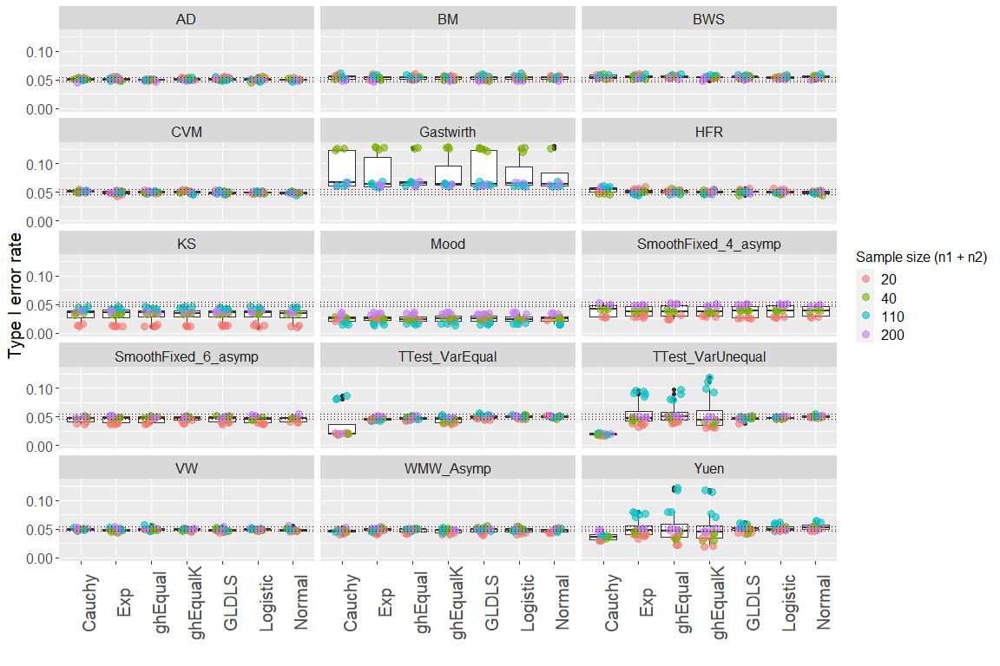
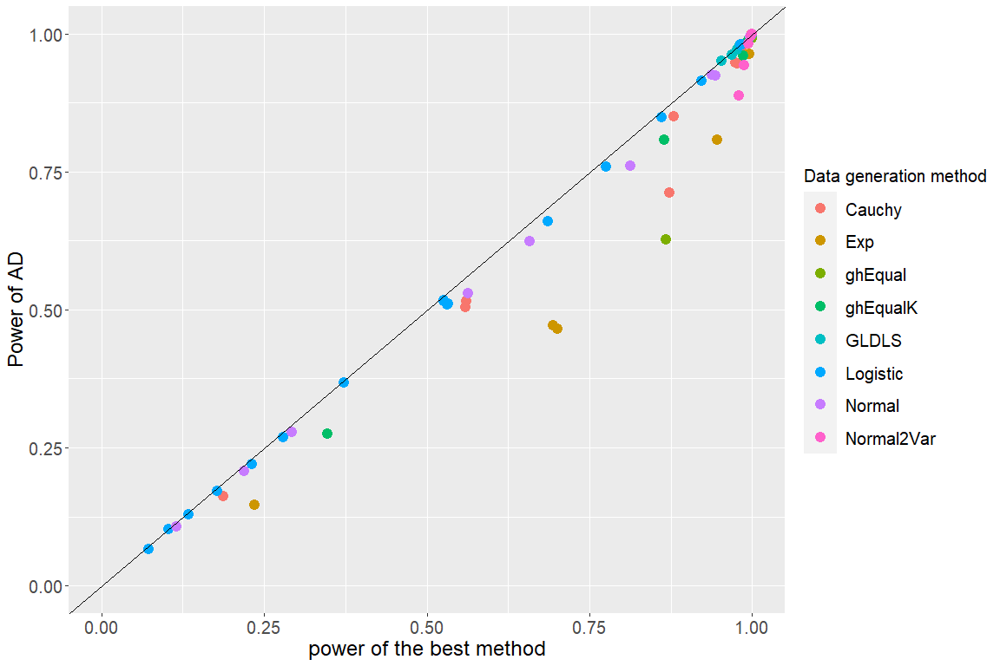
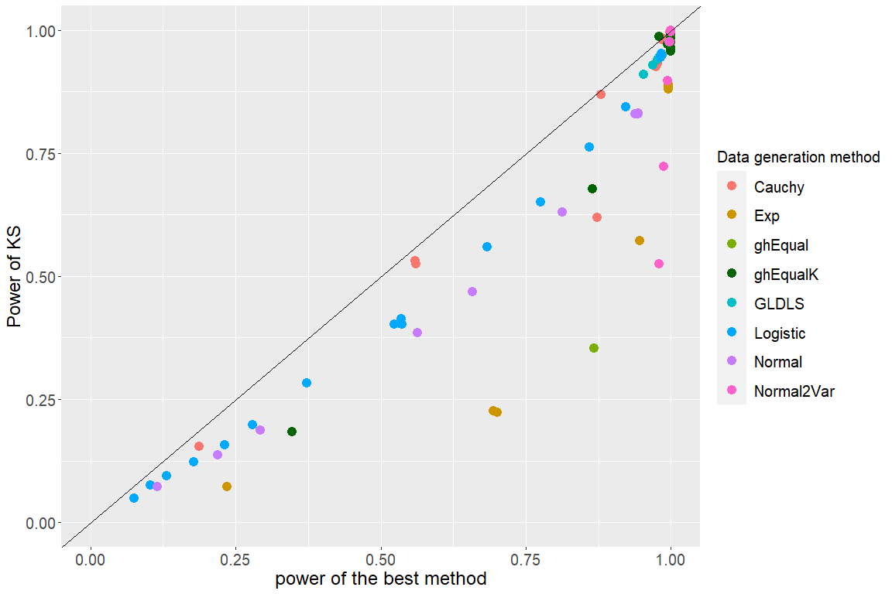
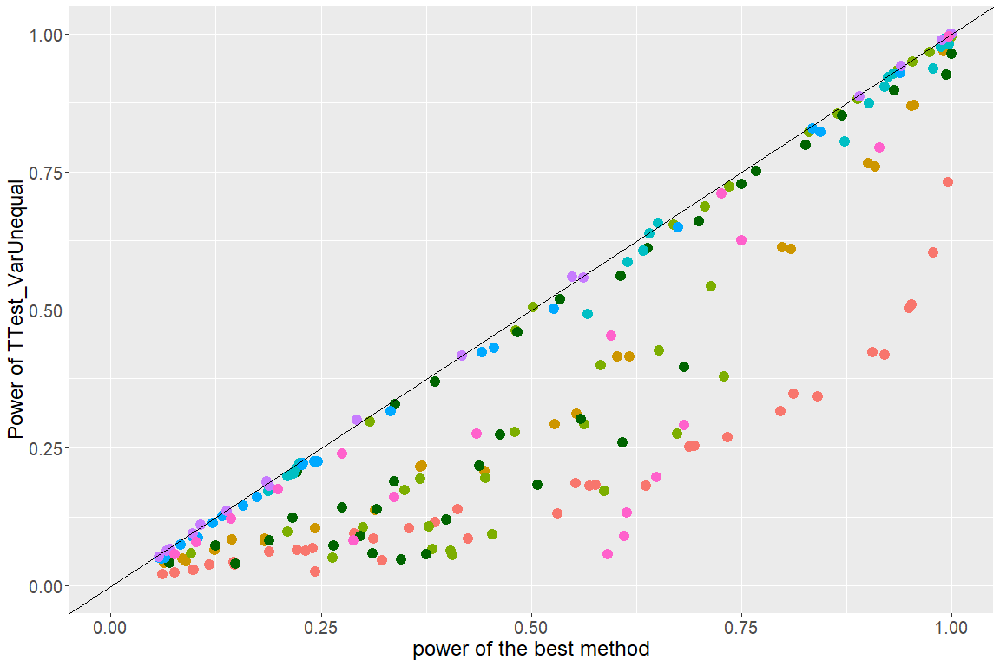
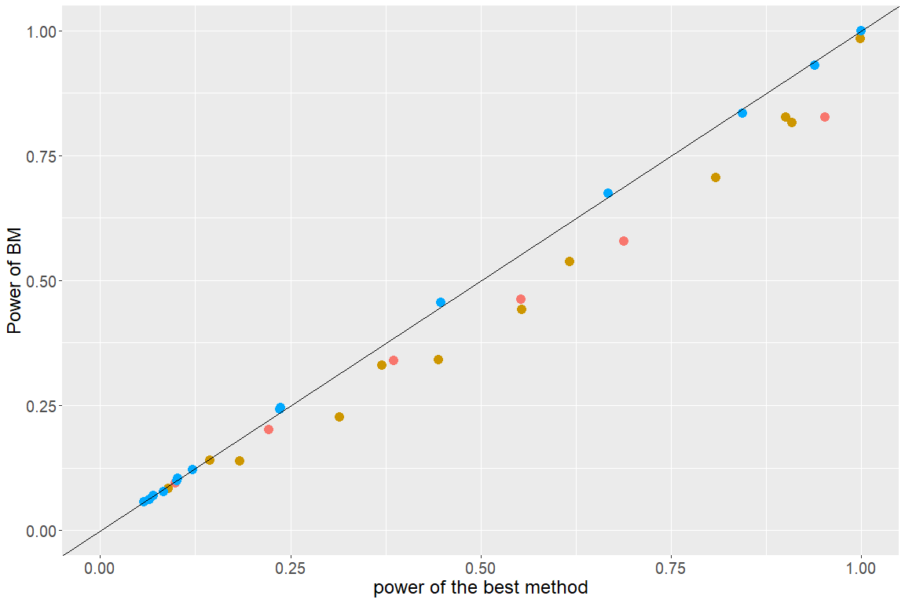
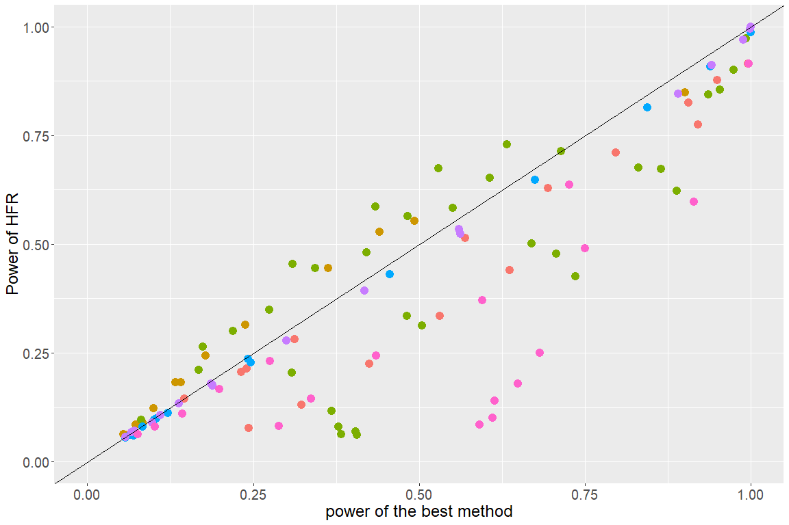

In this report, we will summarize the results of methods that have been neutralized and show the results that give more insights to the method and simulation scenarios. In section 1, the methods included in this framework will be summarized. In section 2, we will show the type I error rate control of all methods per data generation method. In section 3, the power-power plots of a few selected methods will be discussed, as well as the power-power plots that compare a method to the best results over the different scenario's.

All the results shown in this report can be reproduced using the data in NeutraliseFiles or in the shiny app. This report is the results of choices made by the author, which can be viewed as not neutral. However, we believe that this report doesn't jeopardize the Neutralise initiative as all the results in this report can be reproduced. These results, as well as the results that are not included in this report, are publicly available and can be consulted. This report has been produced with Neutralise (v0.1.0).

## 1. Methods
The methods are summarized in a table in the Appendix (section 6) 

## 2. Type I error rate control

Figure 1 shows the emprical type I error rates of all included methods per data generation method. All tests were performed at the 5% level of significance (red dotted line), and the error rates were computed based on 10000 simulation runs. Points above (below) the lower and upper horizontal reference lines (black dotted line) correspond to liberal (conservative) tests. The liberal tests are the test that have a type I error rate (upper confidence interval of the type I error rate) above the the upper reference line. These liberal tests will be filtered out of the results, as comparing these methods to methods that control the type I error would not be fair or sensible.

The percentile modified Wilcoxon-Mann-Whitney test (Gastwirth), has a type I error rate that is too liberal in all scenarios and will be filtered out. The Welch two sample t-test and the Yuen's test do not control the type I error rate control for scenarios of the exponential distribution, and the g-h distribution. These are scenarios with unequal sample sizes. The two sample student-t test is too liberal for scenarios from the Cauchy distribution with unequal sample sizes between the two groups. In contrast, the asymptotic Kolmogorov-Smirnov test and the Mood's median test have a type I error rate control that is very conservative.

<!-- -->

## 3. Power-power curve: Best method

In the figures below (Figure:2-14), the power-power curves are shown between the specified method versus the 'best' performing method in that specific scenario setting (distribution). These plots are given for sample size 20 (left column) and sample size 200 (right column). All 14 methods are included, we excluded Gastwirth as the method had a type I error rate that was far too liberal for most scenarios. In general, the results with sample size 20 are more scattered, while the results of sample size 200 are more centered around the diagonal and more specifically the top right of the diagonal (highest power results), which is expected as the power increases with sample size. The tests that had a very conservative type I error rate control (KS, Mood), also show power-power curves that reflect the lack of power in comparison to the best performing methods. This lack in power is also noticeable for the results for the Cauchy and g-h distributions of the two sample Student-t test and the Welch t-test. Remarkably, for some scenarios of the normal distributions with unequal variances, the Welch t-test has much lower power than the best competitor, the best competitor is the two sample smooth test with fixed order 4 and Legendre polynomials. For the WMW test, the power-power plot shows that the test has at least similar results in comparison to the best method for the logistic distribution with sample size 200 (as expected), but for the small sample sizes slightly better tests exist. The plots of Anderson-Darling(AD) have more of the observations around the diagonal for both sample sizes in comparison to all other methods. Hence, the AD test has often the largest power, and when it does not, its power is not much smaller than the power of the best competitor (i.e. the points are close to the diagonal). The worst performing test is the two sample smooth test with fixed order 6 and Legendre Polynomials. Based on these results we selected AD, KS, the Welsh test, Student-t test, WMW test and two sample smooth test with fixed order 4 and Legendre polynomials. Hence, the plots are better evaluated in some more detail in the next section.

Figure 2. Left:(n=20)  AD has the largest power in 52 of the  176 scenarios, which is  29.55 % of the scenarios.   The median of the power differences for scenarios where  AD  has smaller power than the best test is  0.0316 --- Right: (n=200)  AD has the largest power in 1 of the  225 scenarios, which is  0.44 % of the scenarios.   The median of the power differences for scenarios where  AD  has smaller power than the best test is  0.0094

Figure 3. Left:(n=20)  KS has the largest power in 0 of the  225 scenarios, which is  0 % of the scenarios.   The median of the power differences for scenarios where  KS  has smaller power than the best test is  0.1635 --- Right: (n=200)  KS has the largest power in 1 of the  225 scenarios, which is  0.44 % of the scenarios.   The median of the power differences for scenarios where  KS  has smaller power than the best test is  0.0357

Figure 4. Left:(n=20)  CVM has the largest power in 32 of the  207 scenarios, which is  15.46 % of the scenarios.   The median of the power differences for scenarios where  CVM  has smaller power than the best test is  0.0291 --- Right: (n=200)  CVM has the largest power in 9 of the  225 scenarios, which is  4 % of the scenarios.   The median of the power differences for scenarios where  CVM  has smaller power than the best test is  0.0078

Figure 5. Left:(n=20)  TTest_VarEqual has the largest power in 31 of the  225 scenarios, which is  13.78 % of the scenarios.   The median of the power differences for scenarios where  TTest_VarEqual  has smaller power than the best test is  0.0866 --- Right: (n=200)  TTest_VarEqual has the largest power in 5 of the  225 scenarios, which is  2.22 % of the scenarios.   The median of the power differences for scenarios where  TTest_VarEqual  has smaller power than the best test is  0.162

Figure 6. Left:(n=20)  TTest_VarUnequal has the largest power in 8 of the  225 scenarios, which is  3.56 % of the scenarios.   The median of the power differences for scenarios where  TTest_VarUnequal  has smaller power than the best test is  0.0455 --- Right: (n=200)  TTest_VarUnequal has the largest power in 5 of the  225 scenarios, which is  2.22 % of the scenarios.   The median of the power differences for scenarios where  TTest_VarUnequal  has smaller power than the best test is  0.1622

Figure 7. Left:(n=20)  Yuen has the largest power in 7 of the  225 scenarios, which is  3.11 % of the scenarios.   The median of the power differences for scenarios where  Yuen  has smaller power than the best test is  0.0758 --- Right: (n=200)  Yuen has the largest power in 1 of the  225 scenarios, which is  0.44 % of the scenarios.   The median of the power differences for scenarios where  Yuen  has smaller power than the best test is  0.029

Figure 8. Left:(n=20)  BM has the largest power in 2 of the  5 scenarios, which is  40 % of the scenarios.   The median of the power differences for scenarios where  BM  has smaller power than the best test is  0.0387 --- Right: (n=200)  BM has the largest power in 8 of the  212 scenarios, which is  3.77 % of the scenarios.   The median of the power differences for scenarios where  BM  has smaller power than the best test is  0.0179

Figure 9. Left:(n=20)  VW has the largest power in 1 of the  225 scenarios, which is  0.44 % of the scenarios.   The median of the power differences for scenarios where  VW  has smaller power than the best test is  0.0377 --- Right: (n=200)  VW has the largest power in 0 of the  207 scenarios, which is  0 % of the scenarios.   The median of the power differences for scenarios where  VW  has smaller power than the best test is  0.02

Figure 10. Left:(n=20)  Mood has the largest power in 0 of the  225 scenarios, which is  0 % of the scenarios.   The median of the power differences for scenarios where  Mood  has smaller power than the best test is  0.1575 --- Right: (n=200)  Mood has the largest power in 0 of the  225 scenarios, which is  0 % of the scenarios.   The median of the power differences for scenarios where  Mood  has smaller power than the best test is  0.1337

Figure 11. Left:(n=20)  HFR has the largest power in 28 of the  115 scenarios, which is  24.35 % of the scenarios.   The median of the power differences for scenarios where  HFR  has smaller power than the best test is  0.0523 --- Right: (n=200)  HFR has the largest power in 8 of the  183 scenarios, which is  4.37 % of the scenarios.   The median of the power differences for scenarios where  HFR  has smaller power than the best test is  0.0116

Figure 12. Left:(n=20)  WMW_Asymp has the largest power in 1 of the  225 scenarios, which is  0.44 % of the scenarios.   The median of the power differences for scenarios where  WMW_Asymp  has smaller power than the best test is  0.0478 --- Right: (n=200)  WMW_Asymp has the largest power in 8 of the  225 scenarios, which is  3.56 % of the scenarios.   The median of the power differences for scenarios where  WMW_Asymp  has smaller power than the best test is  0.0193

Figure 13. Left:(n=20)  SmoothFixed_4_asymp has the largest power in 24 of the  225 scenarios, which is  10.67 % of the scenarios.   The median of the power differences for scenarios where  SmoothFixed_4_asymp  has smaller power than the best test is  0.132 --- Right: (n=200)  SmoothFixed_4_asymp has the largest power in 23 of the  225 scenarios, which is  10.22 % of the scenarios.   The median of the power differences for scenarios where  SmoothFixed_4_asymp  has smaller power than the best test is  0.071

Figure 14. Left:(n=20)  SmoothFixed_6_asymp has the largest power in 0 of the  225 scenarios, which is  0 % of the scenarios.   The median of the power differences for scenarios where  SmoothFixed_6_asymp  has smaller power than the best test is  0.4511 --- Right: (n=200)  SmoothFixed_6_asymp has the largest power in 0 of the  225 scenarios, which is  0 % of the scenarios.   The median of the power differences for scenarios where  SmoothFixed_6_asymp  has smaller power than the best test is  0.8241

## 4. Power-Power curve

The power-power plots are based on 10000 simulation runs and 5% significance level. The scenarios where the type I error was too liberal are filtered out. The first comparison (Figure 15, top left), the Anderson-Darling test (AD) versus the Kolmogrov Smirnov test (KS), shows that AD has a higher power in most scenarios. For some scenario's in the Cauchy distribution and Normal distribution with unequal variances, KS has a higher power. These scenarios are characterized with unequal sample sizes. Moreover, the asymmetry of the plot suggests that when the AD outperforms the KS test, it is by a larger margin than it is the other way around. The power-power plot of the two sample student t-test and the Welch test (Figure 15, top right), show the results of most scenarios are close to the diagonal which means that they have similar results in those scenarios. However for the scenarios from the Normal distribution with unequal variances and unequal sample sizes, the Welch test outperforms the two sample student-t test. The third comparison (Figure 15, down left), compares the Welch t-test to the Wilcoxon-Mann-Whitney test (WMW). In this comparison it's clear that WMW outperforms the Welch t-test for scenarios from the Cauchy and Exponential distribution. The plot also shows that many points are close to the diagonal (particularly for the symmetric distributions), indicating that for these distributions the powers of the two tests are close to one another. However, there are still many other points far off the diagonal, towards both sides. This shows that for some scenarios (skew and/or heavy tailed distributions) the powers of the WMW test and the Welch t-test may be very different. Sometimes the WMW wins, other times the Welch t-test wins. The last plot (Figure 15, down right) compares WMW with Two sample smooth test with fixed order 4 and Legendre polynomials. WMW outperforms the smooth test in the logistic distribution, and has a higher power in the scenarios that come from the more symmetric distributions. In contrast, the smooth test has a higher power in the more skewed and/or heavy tailed distributions, which is what we would expect from the smooth test.

Figure 15. Power-Power plots for comparing two methods. Top left: Anderson-Darling versus Kolmogrov Smirnov test. Top right: Welch versus the two sample student-t test. Down left: Welch two sample test versus the Wilcoxon-Mann-Whitney test. Down Right: Two sample smooth test with fixed order 4 and Legendre polynomials versus the Wilcoxon-Mann-Whitney test.

## 5. Conclusion

In terms of Type I error rate control the results has shown that the Welch test and Yuen test, which is a derivative of the Welch test but with trimmed means, do not perform well for skewed and heavy tailed distributions in combination with unequal sample sizes. Moods test and KS, have a conservative type I error rate control, especially for small sample sizes. The methods that have a conservative type I error rate have shown that they are also lacking in terms of power. AD has performed well in most scenarios. The WMW test performed well in scenarios with symmetrical distributions (with equal sample sizes), but less in scenarios with opposite skewed distributions and heavy tailed distributions.\
In general, the methods perform well for the distributions and scenarios they are developed for. The methods distinguish from each other in scenarios that have small sample size and/or unequal balanced design, in combination with skewed and heavy tailed distributions. Here, the more robust methods such as AD, CVM perform better.

## 6. Appendix
<table style='width:30%; font-family: "Arial Narrow", "Source Sans Pro", sans-serif; width: auto !important; margin-left: auto; margin-right: auto; width: auto !important; margin-left: auto; margin-right: auto;' class=" lightable-classic table table-striped">
<caption>Table 1: Summary of included methods</caption>
 <thead>
  <tr>
   <th style="text-align:left;"> Abbriviation </th>
   <th style="text-align:left;"> Name </th>
   <th style="text-align:left;"> Description </th>
   <th style="text-align:left;"> References </th>
  </tr>
 </thead>
<tbody>
  <tr>
   <td style="text-align:left;"> AD </td>
   <td style="text-align:left;"> Asymptotic Anderson-Darling test </td>
   <td style="text-align:left;"> Two sample Anderson-Darling test. P-values based on asymptotic approximation. </td>
   <td style="text-align:left;"> Scholz, F. W., &amp; Stephens, M. A. (1987). K-Sample Anderson-Darling Tests. Journal of the American Statistical Association, 82(399), 918-924. https://doi.org/10.2307/2288805 (Rfunction: https://www.rdocumentation.org/packages/kSamples/versions/1.2-9/topics/ad.test) </td>
  </tr>
  <tr>
   <td style="text-align:left;"> BM </td>
   <td style="text-align:left;"> Brunner-Munzel test </td>
   <td style="text-align:left;"> The Brunner--Munzel test for stochastic equality of two samples, which is also known as the Generalized Wilcoxon test. </td>
   <td style="text-align:left;"> Brunner, Edgar, and Ullrich Munzel. "The nonparametric Behrens-Fisher problem: asymptotic theory and a small-sample approximation." Biometrical Journal: Journal of Mathematical Methods in Biosciences 42.1 (2000): 17-25.(Rfunction: https://www.rdocumentation.org/packages/lawstat/versions/3.4/topics/brunner.munzel.test) </td>
  </tr>
  <tr>
   <td style="text-align:left;"> BWS </td>
   <td style="text-align:left;"> Asymptotic Baumgartner-Weiss-Schindler test test </td>
   <td style="text-align:left;"> Two sample Baumgartner-Weiss-Schindler test test. P-values based on asymptotic approximation. </td>
   <td style="text-align:left;"> W. Baumgartner, P. Weiss, H. Schindler, ’A nonparametric test for the general two-sample problem’, Biometrics 54, no. 3 (Sep., 1998): pp. 1129-1135. </td>
  </tr>
  <tr>
   <td style="text-align:left;"> CVM </td>
   <td style="text-align:left;"> Cramer-Von Mises test </td>
   <td style="text-align:left;"> A two-sample permutation based test on the Cramer-Von Mises test statistic. With default bootstraps: 2000 </td>
   <td style="text-align:left;"> Brown, B. M. (1982). Cramer-von Mises Distributions and Permutation Tests.  Biometrika, 69(3), 619-624. https://doi.org/10.2307/2335997 (Rfunction: https://search.r-project.org/CRAN/refmans/twosamples/html/cvm_test.html) </td>
  </tr>
  <tr>
   <td style="text-align:left;"> Gastwirth </td>
   <td style="text-align:left;"> Percentile Modified Wilcoxon-Mann-Whitney test </td>
   <td style="text-align:left;"> The Percentile Modified Wilcoxon-Mann-Whitney test of Gastwirth (1965) with p=r. P-values are calculated from the normal approximation. </td>
   <td style="text-align:left;"> Gastwirth, J. L. (1965). Percentile modifications of two sample rank tests. Journal of the American Statistical Association, 60(312), 1127-1141. </td>
  </tr>
  <tr>
   <td style="text-align:left;"> H </td>
   <td style="text-align:left;"> Asymptotic Hogg-Fisher-Randles adaptive test </td>
   <td style="text-align:left;"> Two sample Hogg-Fisher-Randles adaptive test. P-values based on asymptotic approximation. </td>
   <td style="text-align:left;"> Hogg, R. V., Fisher, D. M., &amp; Randles, R. H. (1975). A two-sample adaptive distribution-free test. Journal of the American Statistical Association, 70(351a), 656-661. </td>
  </tr>
  <tr>
   <td style="text-align:left;"> KS </td>
   <td style="text-align:left;"> Asymptotic Kolmogorov-Smirnov test </td>
   <td style="text-align:left;"> Two sample Kolmogorov-Smirnov test . P-values based on asymptotic approximation </td>
   <td style="text-align:left;"> Kolmogorov, A. N., Sulla Determinazione Empirica di Una Legge di Distribuzione, Giornale dell'Istituto Italiano degli Attuari, 4. 83-91. 1933. Smirnoff, N. "Sur les ?carts de la courbe de distribution empirique." Matematicheskii Sbornik 48.1 (1939): 3-26. </td>
  </tr>
  <tr>
   <td style="text-align:left;"> Mood </td>
   <td style="text-align:left;"> Mood's median test </td>
   <td style="text-align:left;"> Performs a Mood's median test to compare medians of independent samples. </td>
   <td style="text-align:left;"> MOOD, A. M. (1954). On the asymptotic efficiency of certain non-parametric two-sample tests. Ann. Math.Statist. 25, 514 22. (Rfunction: https://www.rdocumentation.org/packages/RVAideMemoire/versions/0.9-81-2/topics/mood.medtest) </td>
  </tr>
  <tr>
   <td style="text-align:left;"> SmoothFixed_4_asymp </td>
   <td style="text-align:left;"> Asymptotic smooth test of order 4 with Legendre polynomials </td>
   <td style="text-align:left;"> Two sample smooth test with fixed order 4 and Legendre polynomials. P-values based on asymptotic approximation. The implementation is adapted from the R code from Thas (2010). </td>
   <td style="text-align:left;"> Janic‐Wróblewska A., &amp; Ledwina, T. (2000). Data driven rank test for two‐sample problem. Scandinavian Journal of Statistics, 27(2), 281-297.Thas, O. (2010). Comparing distributions (Vol. 233). New York: Springer. </td>
  </tr>
  <tr>
   <td style="text-align:left;"> SmoothFixed_6_asymp </td>
   <td style="text-align:left;"> Asymptotic smooth test of order 6 with Legendre polynomials </td>
   <td style="text-align:left;"> Two sample smooth test with fixed order 6 and Legendre polynomials. P-values based on asymptotic approximation.The implementation is adapted from the R code from Thas (2010). </td>
   <td style="text-align:left;"> Janic‐Wróblewska A., &amp; Ledwina, T. (2000). Data driven rank test for two‐sample problem. Scandinavian Journal of Statistics, 27(2), 281-297. Thas, O. (2010). Comparing distributions (Vol. 233). New York: Springer. </td>
  </tr>
  <tr>
   <td style="text-align:left;"> TTest_VarEqual </td>
   <td style="text-align:left;"> Two-sample Student's t-Test </td>
   <td style="text-align:left;"> Two sample t-test under equal variance assumption. </td>
   <td style="text-align:left;"> None </td>
  </tr>
  <tr>
   <td style="text-align:left;"> TTest_VarUnequal </td>
   <td style="text-align:left;"> Welch two-sample t-test </td>
   <td style="text-align:left;"> Two sample t-test without equal variance assumption. </td>
   <td style="text-align:left;"> Welch, Bernard L. "The significance of the difference between two means when the population variances are unequal." Biometrika 29.3/4 (1938): 350-362. </td>
  </tr>
  <tr>
   <td style="text-align:left;"> VW </td>
   <td style="text-align:left;"> van der Waerden normal scores test </td>
   <td style="text-align:left;"> Performs a van der Waerden test of the null hypothesis that the location parameters of the distribution of x are the same in each group (sample). The alternative is that they differ in at least one. </td>
   <td style="text-align:left;"> van der Waerden, B.L. (1953). "Order tests for the two-sample problem. II, III", Proceedings of the Koninklijke Nederlandse Akademie van Wetenschappen, Serie A, 564, 303-310, 311-316. (Rfunction: https://search.r-project.org/CRAN/refmans/DescTools/html/VanWaerdenTest.html) </td>
  </tr>
  <tr>
   <td style="text-align:left;"> WMW_Asymp </td>
   <td style="text-align:left;"> Asymptotic Wilcoxon-Mann-Whitney test </td>
   <td style="text-align:left;"> Two sample Wilcoxon-Mann-Whitney test. P-values based on asymptotic approximation </td>
   <td style="text-align:left;"> Wilcoxon, F. (1945). Individual comparisons by ranking methods. Biom. Bull., 1, 80-83. </td>
  </tr>
  <tr>
   <td style="text-align:left;"> Yuen </td>
   <td style="text-align:left;"> Yuen's test </td>
   <td style="text-align:left;"> Yuen's test for trimmed means </td>
   <td style="text-align:left;"> Yuen, K. K. (1974). The two sample trimmed t for unequal population variances. Biometrika, 61, 165-170 (https://cran.r-project.org/web/packages/WRS2/vignettes/WRS2.pdf) </td>
  </tr>
</tbody>
</table>

<table style='width:30%; font-family: "Arial Narrow", "Source Sans Pro", sans-serif; width: auto !important; margin-left: auto; margin-right: auto; width: auto !important; margin-left: auto; margin-right: auto;' class=" lightable-classic table table-striped">
<caption>Table 1: Summary of included methods</caption>
 <thead>
  <tr>
   <th style="text-align:left;"> Abbriviation </th>
   <th style="text-align:left;"> Hypotheses </th>
   <th style="text-align:left;"> References </th>
  </tr>
 </thead>
<tbody>
  <tr>
   <td style="text-align:left;"> AD </td>
   <td style="text-align:left;"> The null hypothesis states that two independent samples have the same underlying distribution. The alternative hypothesis states that two independent samples have different underlying distributions. </td>
   <td style="text-align:left;"> Scholz, F. W., &amp; Stephens, M. A. (1987). K-Sample Anderson-Darling Tests. Journal of the American Statistical Association, 82(399), 918-924. https://doi.org/10.2307/2288805 (Rfunction: https://www.rdocumentation.org/packages/kSamples/versions/1.2-9/topics/ad.test) </td>
  </tr>
  <tr>
   <td style="text-align:left;"> BM </td>
   <td style="text-align:left;"> The null hypothesis states stochastic equality P(X&gt;Y) = P(X&lt;Y), i.e. p = P(X&lt;Y)+ 0.5 P(X=Y) = 0.5. The alternative hypothesis states p is not equal to 0.5. </td>
   <td style="text-align:left;"> Brunner, Edgar, and Ullrich Munzel. "The nonparametric Behrens-Fisher problem: asymptotic theory and a small-sample approximation." Biometrical Journal: Journal of Mathematical Methods in Biosciences 42.1 (2000): 17-25.(Rfunction: https://www.rdocumentation.org/packages/lawstat/versions/3.4/topics/brunner.munzel.test) </td>
  </tr>
  <tr>
   <td style="text-align:left;"> BWS </td>
   <td style="text-align:left;"> The null hypothesis states that two independent samples have the same underlying distribution. The alternative hypothesis states that two independent samples have different underlying distributions. </td>
   <td style="text-align:left;"> W. Baumgartner, P. Weiss, H. Schindler, ’A nonparametric test for the general two-sample problem’, Biometrics 54, no. 3 (Sep., 1998): pp. 1129-1135. </td>
  </tr>
  <tr>
   <td style="text-align:left;"> CVM </td>
   <td style="text-align:left;"> The null hypothesis is defined as two samples that come from the same distribution, against the alternative the samples differ in location. </td>
   <td style="text-align:left;"> Brown, B. M. (1982). Cramer-von Mises Distributions and Permutation Tests.  Biometrika, 69(3), 619-624. https://doi.org/10.2307/2335997 (Rfunction: https://search.r-project.org/CRAN/refmans/twosamples/html/cvm_test.html) </td>
  </tr>
  <tr>
   <td style="text-align:left;"> Gastwirth </td>
   <td style="text-align:left;"> The null hypothesis is defined as P(X&lt;=Y)= 0.5, which coincides with the equality of distributions under the assumption of symmetry and equal shape. The alternative hypothesis is that P(X&lt;=Y) is not equal to 0.5, which can be interpreted as a location shift. </td>
   <td style="text-align:left;"> Gastwirth, J. L. (1965). Percentile modifications of two sample rank tests. Journal of the American Statistical Association, 60(312), 1127-1141. </td>
  </tr>
  <tr>
   <td style="text-align:left;"> H </td>
   <td style="text-align:left;"> The null hypothesis is defined as P(X&lt;=Y)= 0.5, which coincides with the equality of distributions under the assumption of symmetry and equal shape. The alternative hypothesis is that P(X&lt;=Y) is not equal to 0.5. </td>
   <td style="text-align:left;"> Hogg, R. V., Fisher, D. M., &amp; Randles, R. H. (1975). A two-sample adaptive distribution-free test. Journal of the American Statistical Association, 70(351a), 656-661. </td>
  </tr>
  <tr>
   <td style="text-align:left;"> KS </td>
   <td style="text-align:left;"> The null hypothesis states that two independent samples have the same underlying distribution. The alternative hypothesis states that two independent samples have different underlying distributions. </td>
   <td style="text-align:left;"> Kolmogorov, A. N., Sulla Determinazione Empirica di Una Legge di Distribuzione, Giornale dell'Istituto Italiano degli Attuari, 4. 83-91. 1933. Smirnoff, N. "Sur les ?carts de la courbe de distribution empirique." Matematicheskii Sbornik 48.1 (1939): 3-26. </td>
  </tr>
  <tr>
   <td style="text-align:left;"> Mood </td>
   <td style="text-align:left;"> The null hypothesis is defined for testings equality of medians, while assuming that the distributions are otherwise the same. The alternative states that the medians are different in both groups. </td>
   <td style="text-align:left;"> MOOD, A. M. (1954). On the asymptotic efficiency of certain non-parametric two-sample tests. Ann. Math.Statist. 25, 514 22. (Rfunction: https://www.rdocumentation.org/packages/RVAideMemoire/versions/0.9-81-2/topics/mood.medtest) </td>
  </tr>
  <tr>
   <td style="text-align:left;"> SmoothFixed_4_asymp </td>
   <td style="text-align:left;"> The null hypothesis states that two independent samples have the same underlying distribution. The alternative hypothesis states that two independent samples have different underlying distributions based on the first 4 moments. </td>
   <td style="text-align:left;"> Janic‐Wróblewska A., &amp; Ledwina, T. (2000). Data driven rank test for two‐sample problem. Scandinavian Journal of Statistics, 27(2), 281-297.Thas, O. (2010). Comparing distributions (Vol. 233). New York: Springer. </td>
  </tr>
  <tr>
   <td style="text-align:left;"> SmoothFixed_6_asymp </td>
   <td style="text-align:left;"> The null hypothesis states that two independent samples have the same underlying distribution. The alternative hypothesis states that two independent samples have different underlying distributions based on the first 6 moments. </td>
   <td style="text-align:left;"> Janic‐Wróblewska A., &amp; Ledwina, T. (2000). Data driven rank test for two‐sample problem. Scandinavian Journal of Statistics, 27(2), 281-297. Thas, O. (2010). Comparing distributions (Vol. 233). New York: Springer. </td>
  </tr>
  <tr>
   <td style="text-align:left;"> TTest_VarEqual </td>
   <td style="text-align:left;"> The null hypothesis states that both samples come from same underlying distribution, under the assumption of normality and equal variances. The alternative hypothesis is defined as a location shift (means differ between the groups). </td>
   <td style="text-align:left;"> None </td>
  </tr>
  <tr>
   <td style="text-align:left;"> TTest_VarUnequal </td>
   <td style="text-align:left;"> The null hypothesis states that both samples come from the same underlying distribution, restricted under the assumption of normality.  The alternative hypothesis is defined as a location shift (means differ between the groups). </td>
   <td style="text-align:left;"> Welch, Bernard L. "The significance of the difference between two means when the population variances are unequal." Biometrika 29.3/4 (1938): 350-362. </td>
  </tr>
  <tr>
   <td style="text-align:left;"> VW </td>
   <td style="text-align:left;"> The null hypothesis is defined as P(X&lt;=Y)= 0.5, which coincides with the equality of distributions under the assumption of symmetry and equal shape. The alternative hypothesis is that P(X&lt;=Y) is not equal to 0.5, which can be interpreted as a location shift. </td>
   <td style="text-align:left;"> van der Waerden, B.L. (1953). "Order tests for the two-sample problem. II, III", Proceedings of the Koninklijke Nederlandse Akademie van Wetenschappen, Serie A, 564, 303-310, 311-316. (Rfunction: https://search.r-project.org/CRAN/refmans/DescTools/html/VanWaerdenTest.html) </td>
  </tr>
  <tr>
   <td style="text-align:left;"> WMW_Asymp </td>
   <td style="text-align:left;"> The null hypothesis is defined as P(X&lt;=Y)= 0.5, which coincides to equality of distributions under the assumption of symmetry and equal shape. The alternative hypothesis that P(X&lt;=Y) is not equal to 0.5. </td>
   <td style="text-align:left;"> Wilcoxon, F. (1945). Individual comparisons by ranking methods. Biom. Bull., 1, 80-83. </td>
  </tr>
  <tr>
   <td style="text-align:left;"> Yuen </td>
   <td style="text-align:left;"> The null hypothesis states that both samples come from the same underlying distribution.  The alternative hypothesis is defined as a location shift (trimmed means differ between the groups). </td>
   <td style="text-align:left;"> Yuen, K. K. (1974). The two sample trimmed t for unequal population variances. Biometrika, 61, 165-170 (https://cran.r-project.org/web/packages/WRS2/vignettes/WRS2.pdf) </td>
  </tr>
</tbody>
</table>
